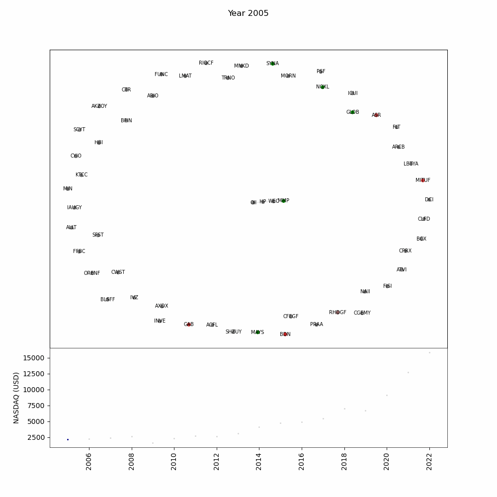

# Network_Analysis

Download dataset from [here](https://www.kaggle.com/datasets/paultimothymooney/stock-market-data?resource=download)

## Getting started
- Download dataset
- The downloaded stock_market_data folder should be in the data folder ```./data/stock_market_data/```
- Run ```clean.py```

## Update all_data.csv and stockdf.csv
- Run ```clean.py t```


